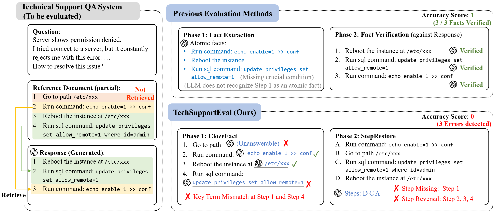
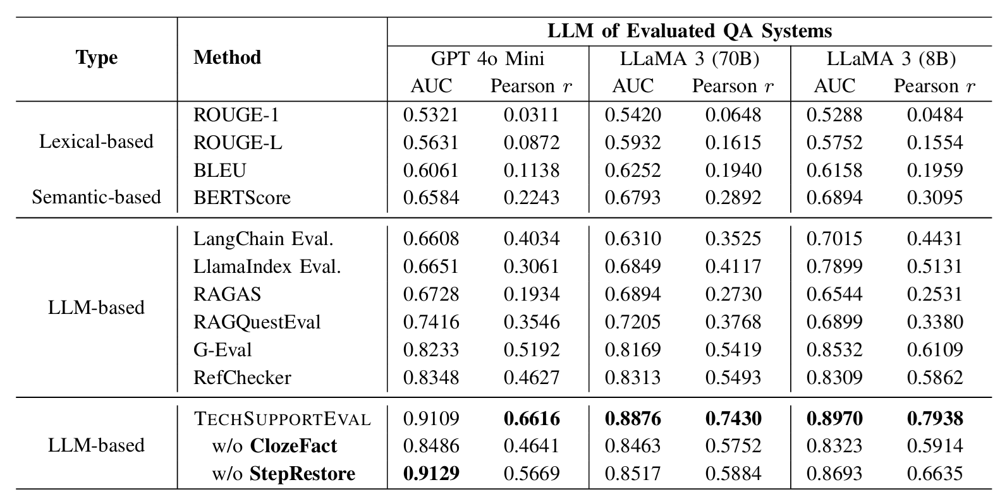

# TechSupportEval

TechSupportEval is an automated evaluation framework for technical support QA.

## Introduction

TechSupportEval introduces two novel techniques:

* **ClozeFact**: This method formulates fact verification as a cloze test, utilizing an LLM to fill in missing key terms, ensuring precise matching of key information.

* **StepRestore**: This technique shuffles the ground truth steps and uses an LLM to reconstruct the steps in the correct order, verifying both the step sequence and completeness.

As shown in the illustrative example below:



We propose a benchmark dataset built upon the publicly available TechQA dataset, which includes responses generated by various levels of QA systems. TechSupportEval achieves an AUC of 0.91, outperforming the state-of-the-art method by 7.6%.

Detailed results is shown in the table below:



## Usage

To use this evaluation framework, follow these steps:

1. Download the repository and navigate to the directory

    ```bash
    cd TechSupportEval
    ```

2. Set up the environment (Conda recommended)

    ```bash
    conda create --name=tseval python=3.10  
    conda activate tseval  
    pip install -r requirements.txt  
    ```

3. Configure the LLM for evaluation

    By default, we use OpenAI's GPT-4o-mini for evaluation.

    ```bash
    cp .env.example .env  
    ```

    Then, update `.env` with your `OPENAI_API_KEY` and optionally `OPENAI_API_BASE`.

4. Run an example test

    ```bash
    python -m tseval.metric examples/1.json  
    ```

### Command format

```bash
python -m tseval.metric <input_path> [output_path]
```

`<input_path>`: A JSON file containing three required fields: `question`, `ground_truth`, and `answer`.

The evaluation results will be displayed in the console.

If `<output_path>` is specified, a JSON report will be saved to that location.

### Example outputs

The evaluation results for `examples/1.json` and `examples/2.json` are available in:
- `examples/1_result.json`
- `examples/2_result.json`

## Datasets

We constructed a benchmark dataset based on TechQA, the most comprehensive publicly available technical support QA dataset. We generated responses using multiple QA systems with varying capability levels and obtained human expert annotations for their true accuracy.

We implemented three RAG-based QA systems using LangChain, each leveraging a different foundation model:

- GPT-4o Mini
- LLaMA 3 (70B)
- LLaMA 3 (8B)

Each QA system was used to generate responses for all **282** filtered questions. We then conducted a human evaluation with **5** domain experts, who annotated each response for accuracy.

The implementations of these three models can be found in the `rag` directory. The generated answers and human evaluation data correspond to `data/final/techqa{1,2,3}.json`, which collectively form the dataset used in this work.
